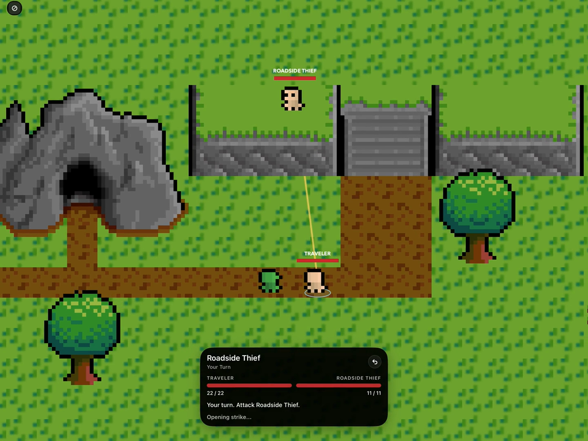

# Anthony Petrillo - Game Development Portfolio

Short gameplay demonstrations from original, systems-driven projects. These videos show playable builds and real runtime behavior; private source review can be arranged when appropriate.

## Empire Eternal

**Complete gameplay and systems walkthrough**

[Watch the 2:05 MP4](media/empire-eternal/empire-eternal-80-second-highlight.mp4)

Empire Eternal is an original Swift and SpriteKit RPG engine developed as a playable vertical slice. The highlight shows:

- continuous world traversal and an explorable town/interior flow;
- data-driven quest dialogue, choices, rewards, and reputation feedback;
- recruitable companion behavior, authored choices, and free-typed dialogue;
- combat, body looting, inventory, and equipment management;
- save/load plus data-driven skills, attributes, and perks;
- crime, guard response, arrest, confiscation, and jail state transitions.

The project is a substantial playable engineering prototype, not a claimed production release or content-complete commercial game.

## Lunar Loop

[Watch the Lunar Loop 4K60 gameplay portfolio](https://apetrillo99.github.io/Lunar-Loop-Portfolio/)

Lunar Loop is a systems-heavy Godot logistics and colony simulation project with a separate showcase covering live carrier, air, and excavator fleets; conveyors and factory production; resources, utilities, and player building placement.

## Notes

- Showcase media only; the private project repositories and source assets are not included here.
- Videos are silent so they can be reviewed quickly in professional settings.
- All showcased implementation work was authored specifically for these projects.

Copyright 2026 Anthony Petrillo. All rights reserved.
